<p align="center">
  
</p>

<h1 align="center">xelanote</h1>

<p align="center">
  <strong>Self-hosted, encrypted note-taking with Wikilinks, Backlinks, and a Knowledge Graph.</strong>
  <br />
  <em>Your knowledge, your server, your rules.</em>
</p>

<p align="center">
  <a href="https://github.com/xela-io/xelanote/actions/workflows/ci.yml"></a>
  <a href="https://github.com/xela-io/xelanote/actions/workflows/quality.yml"></a>
  <a href="https://github.com/xela-io/xelanote/actions/workflows/security.yml"></a>
  <a href="https://github.com/xela-io/xelanote/releases"></a>
  <a href="LICENSE"></a>
</p>

<p align="center">
  <a href="#features">Features</a>&nbsp;&nbsp;&bull;&nbsp;&nbsp;
  <a href="#screenshots">Screenshots</a>&nbsp;&nbsp;&bull;&nbsp;&nbsp;
  <a href="#quick-start">Quick Start</a>&nbsp;&nbsp;&bull;&nbsp;&nbsp;
  <a href="#configuration">Configuration</a>&nbsp;&nbsp;&bull;&nbsp;&nbsp;
  <a href="#tech-stack">Tech Stack</a>&nbsp;&nbsp;&bull;&nbsp;&nbsp;
  <a href="#contributing">Contributing</a>
</p>

---

## What is xelanote?

xelanote is a privacy-first, self-hosted note-taking app that combines modern knowledge management (Wikilinks, backlinks, knowledge graph, infinite canvas) with optional end-to-end encryption. It ships as a single Go binary with an embedded SvelteKit frontend and stores everything in one SQLite file — no external database required.

---

## Features

### Editor

- **Four editing modes** — pure Markdown, rendered preview, side-by-side split, and Obsidian-style live preview (inline rendering with syntax visible on the active line)
- **Wikilinks & Backlinks** — `[[note title]]` linking with autocomplete and automatic reverse-reference tracking
- **Inline title editing** — Bear / Apple Notes style; the first line of the editor *is* the title
- **Find & Replace** — VS Code-style `Ctrl+F` / `Ctrl+H` overlay with regex support
- **Command palette** — `Ctrl+K` quick switcher with extensible command registry
- **Table of Contents** — auto-generated from headings; mobile FAB with scroll-progress ring
- **Version history** — up to 100 revisions per note with diff view and one-click restore
- **Due dates** — `@due(YYYY-MM-DD)` syntax with colored badges and a dedicated due-dates page
- **Task management** — checkbox toggling, drag-to-reorder, collapsible completed groups (state synced across devices)
- **Code blocks** — Shiki syntax highlighting with Gruvbox theme and lazy language loading
- **Math** — KaTeX rendering for `$inline$` and `$$display$$` expressions
- **Diagrams** — Mermaid diagram rendering with content-hash caching
- **Image handling** — drag-and-drop / paste upload, resize handles, lazy loading
- **Table builder** — visual row/column picker for Markdown tables
- **Focus mode** — typewriter scrolling with dimmed inactive lines
- **Spell check** — LLM-powered grammar and spelling suggestions (German + English)
- **Autosave** — debounced saves with ETag-based conflict detection
- **Templates & Snippets** — reusable note templates and keyboard-triggered text snippets

### Knowledge Graph

- Interactive force-directed graph of all notes and their connections
- Filter by folder, zoom, pan, and click-to-navigate
- Backlink panel on every note showing all incoming references

### Infinite Canvas

- Free-form spatial board following the [JSON Canvas spec v1.0](https://jsoncanvas.org) (Obsidian-compatible export)
- **Node types** — text cards, embedded note previews, external links, resizable groups
- Drag-and-drop notes from the sidebar, copy/paste, keyboard shortcuts, color presets

### Recipes

- Structured recipe editor with ingredients, servings, prep/cook time, categories, and dietary tags
- **Dynamic scaling** — adjust serving count and all ingredient amounts recalculate
- **AI import** — paste a URL or snap a photo; the recipe is extracted, structured, and translated automatically (including F-to-C conversion)
- **AI suggestions** — find similar recipes, get suggestions from available ingredients, generate new recipes
- Multi-image gallery with drag-to-reorder, captions, and lightbox
- Cookbook collections with sharing support
- Multi-provider AI (Claude, Gemini, ChatGPT) with BYOK (Bring Your Own Key)

### Journal

- One entry per day with calendar navigation and auto-creation
- GitHub-style yearly heatmap showing writing frequency
- Activity stats and streak tracking
- Feature-gated per user (enable in settings)

### Security & Encryption

- **End-to-end encryption** — XChaCha20-Poly1305 with Argon2id KDF and per-note data encryption keys for note payloads
- **Per-note toggle** — encrypt or decrypt individual notes; set folder-level encryption defaults
- **Encrypted search** — client-side MiniSearch index so encrypted notes are fully searchable without server access
- **Recovery key** — account recovery exists, but encrypted-note decryption via recovery reset is not available yet
- **AI boundary** — encrypted notes block server-side AI processing; plaintext notes may transmit content to backend/provider when AI features are used
- **Two-factor authentication** — TOTP (any authenticator app) + WebAuthn/FIDO2 hardware keys + backup codes
- **Auth hardening** — JWT with refresh token rotation, HttpOnly cookies only (no localStorage), CSRF double-submit protection
- **Rate limiting & lockout** — per-endpoint rate limits, exponential-backoff account lockout
- **Security headers** — HSTS, CSP, X-Frame-Options, and more
- **Upload security** — owner-only serving, HMAC-signed URLs, MIME type validation, 10 MB limit; encrypted-note attachments are uploaded as encrypted `.xenc` blobs (uploads in plaintext notes remain server-visible)

### Sharing & Collaboration

- Share notes with other users as **Viewer** or **Editor**
- Folder sharing with automatic permission inheritance for all contained notes
- Recipe collection sharing with 3-tier priority permission chain
- User search for quick permission grants
- Real-time updates via WebSocket across tabs and devices

### Mobile & PWA

- **Progressive Web App** — installable on iOS and Android with offline read/write support
- **Offline mode** — IndexedDB write queue with background sync and conflict resolution dialog
- **Responsive design** — bottom navigation bar, touch-optimized 44px targets (WCAG AA), frosted-glass panels
- **iOS/Android install coach** — guided setup prompts for adding to home screen
- **Portrait lock** — stable orientation for mobile writing

### Desktop App

- **Tauri v2** desktop app for Linux (`.deb` and `.AppImage`)
- Custom title bar, configurable server connection, fullscreen focus mode

### AI Features

- **Text transformations** — format, summarize, expand, translate (DE/EN), formal/informal, custom instructions
- **Tag suggestions** — LLM analyzes note content and suggests relevant tags
- **Link suggestions** — AI recommends Wikilinks to related notes in your library
- **Note summaries** — streaming AI-generated summaries in a collapsible sidebar panel
- **Multi-provider** — Claude (Anthropic), Gemini (Google), ChatGPT (OpenAI) with per-provider model selection
- **BYOK** — bring your own API keys, stored encrypted per user

### Organization

- Folder hierarchy with drag-and-drop reordering and nesting
- Tags with autocomplete and filter UI
- Note and folder color labels
- Full-text search powered by SQLite FTS5 (with snippet highlighting)
- Quick search (`Ctrl+P`) for instant title-based lookup
- Trash with soft-delete and restore
- Markdown import (ZIP with frontmatter) and export

### Customization & i18n

- **Gruvbox Light & Dark** themes with separate preview theme setting
- Full internationalization — **German** and **English** (~604 i18n keys per locale)
- Configurable editor preferences (font size, autosave, spell check, line numbers, etc.)

### Admin

- User management with role assignment and account deletion
- Activity logs with filtering and pagination
- System-wide settings and growth statistics dashboard

---

## Screenshots

<p align="center">
  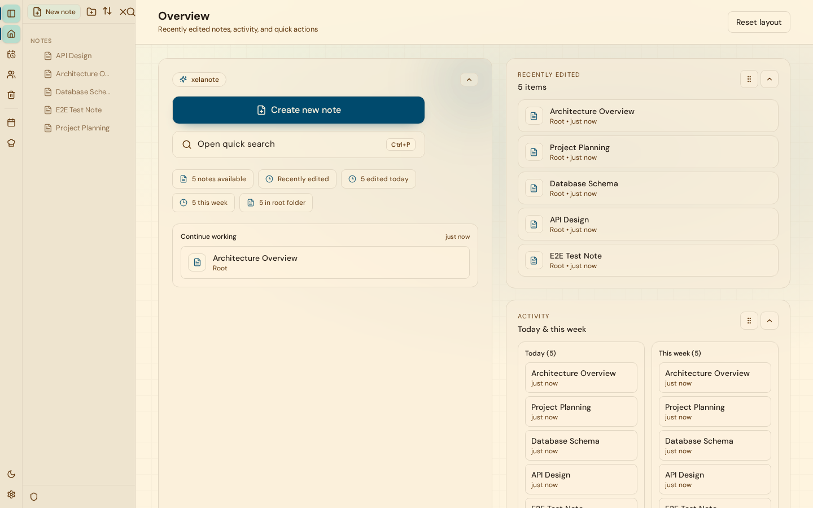
  <br /><sub>Home dashboard with activity stats, quick search, and recent notes</sub>
</p>

<p align="center">
  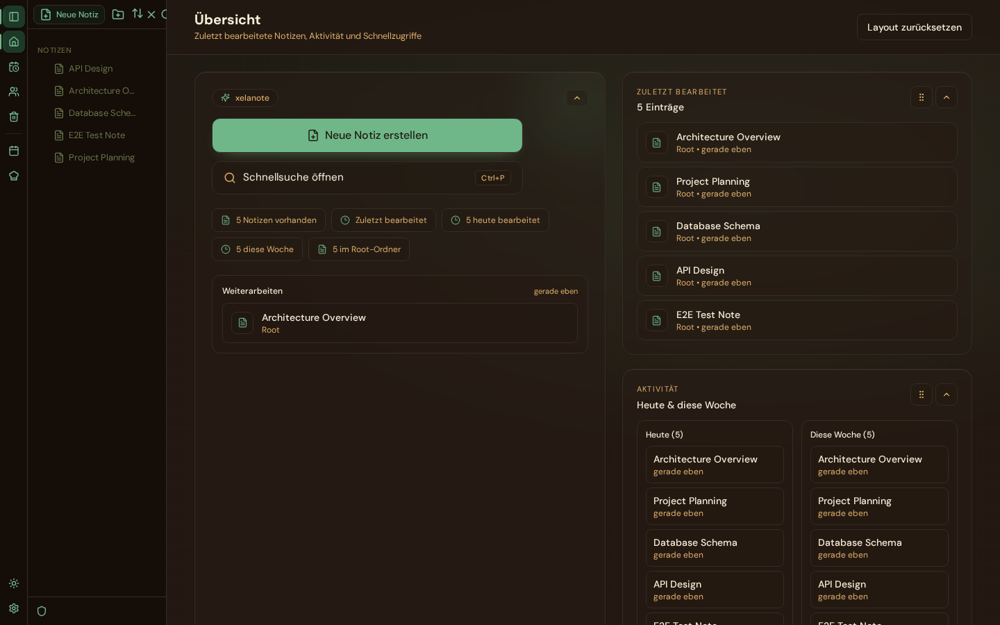
  <br /><sub>Dark mode — Gruvbox Dark theme</sub>
</p>

<p align="center">
  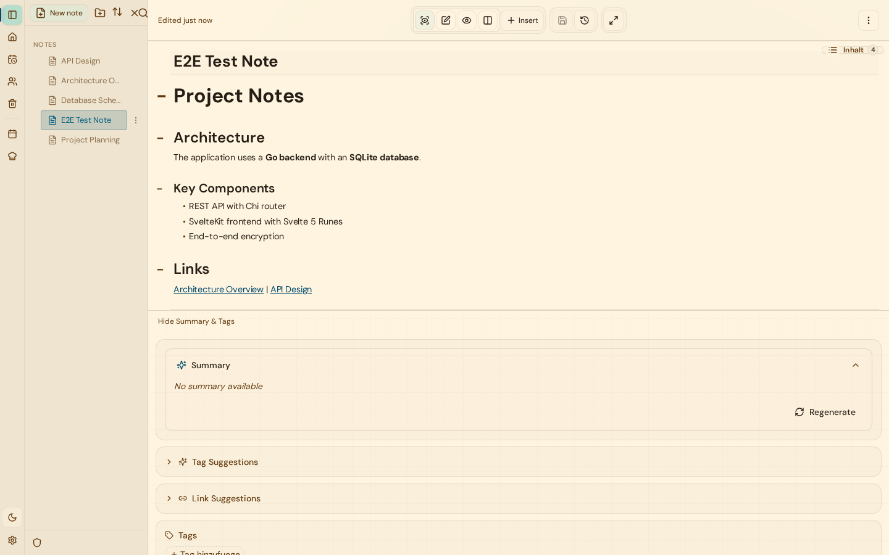
  <br /><sub>Live preview editor with sidebar, AI summary, tag and link suggestions</sub>
</p>

<p align="center">
  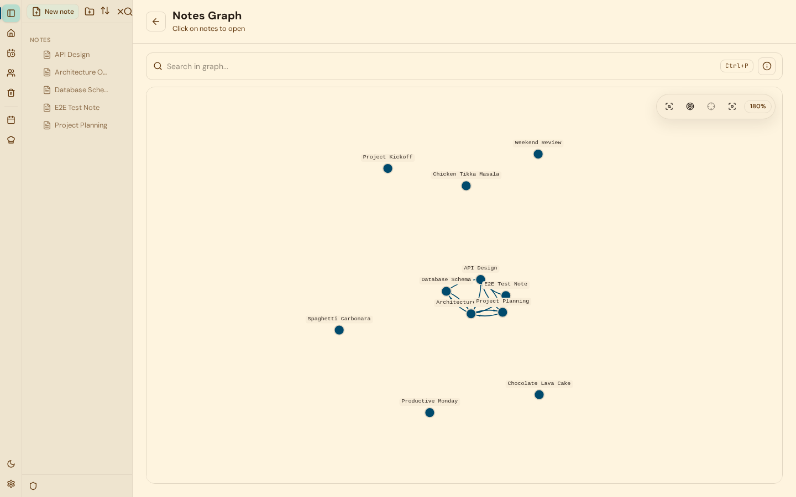
  <br /><sub>Interactive knowledge graph showing note connections</sub>
</p>

<p align="center">
  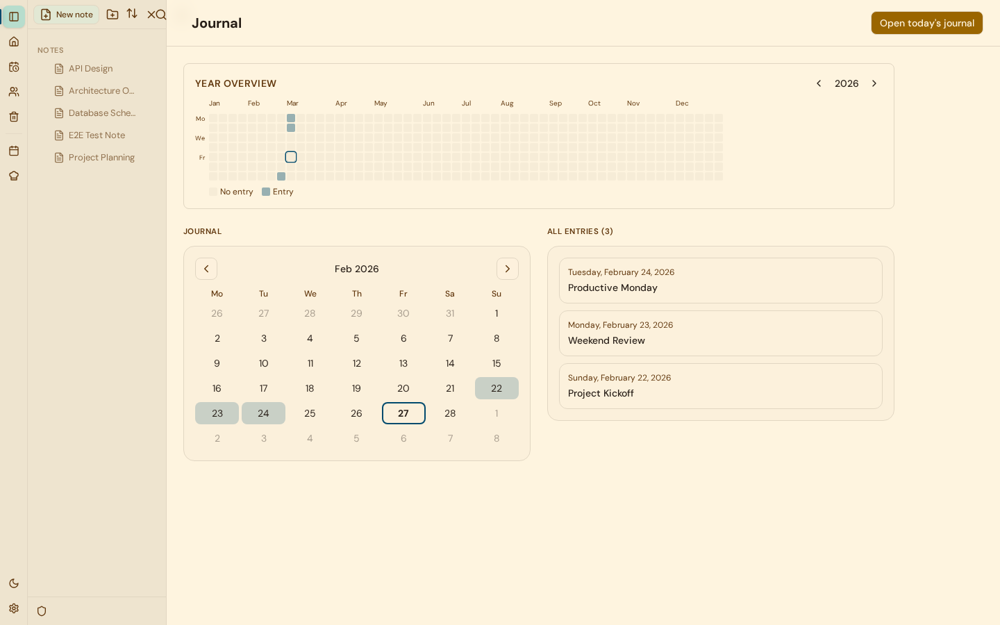
  <br /><sub>Journal with yearly heatmap, calendar navigation, and entry list</sub>
</p>

<p align="center">
  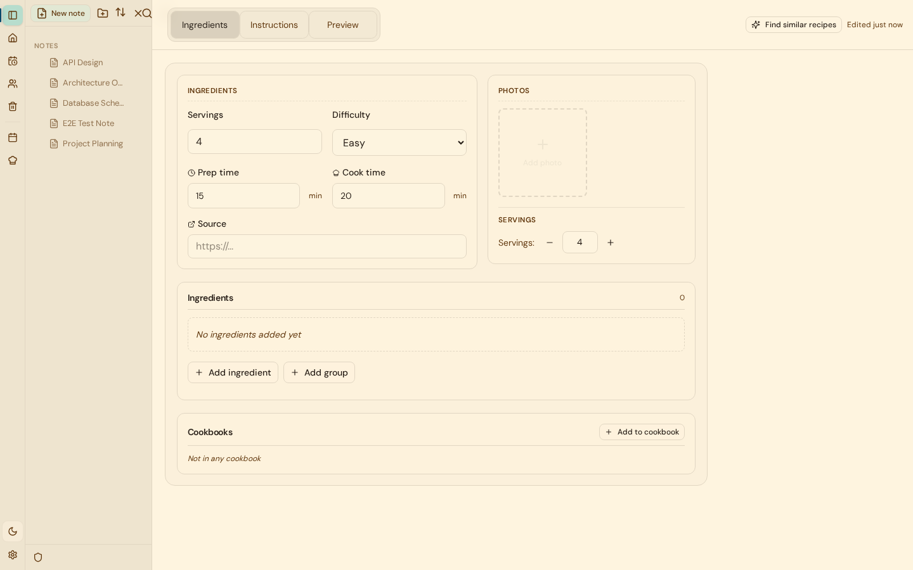
  <br /><sub>Structured recipe editor with ingredients, servings, and photo gallery</sub>
</p>

<p align="center">
  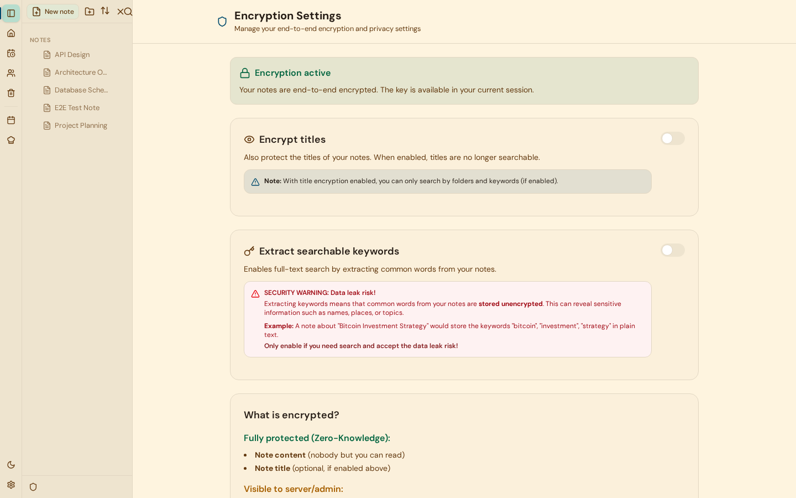
  <br /><sub>End-to-end encryption settings with explicit privacy boundaries</sub>
</p>

### Mobile (PWA)

<p align="center">
  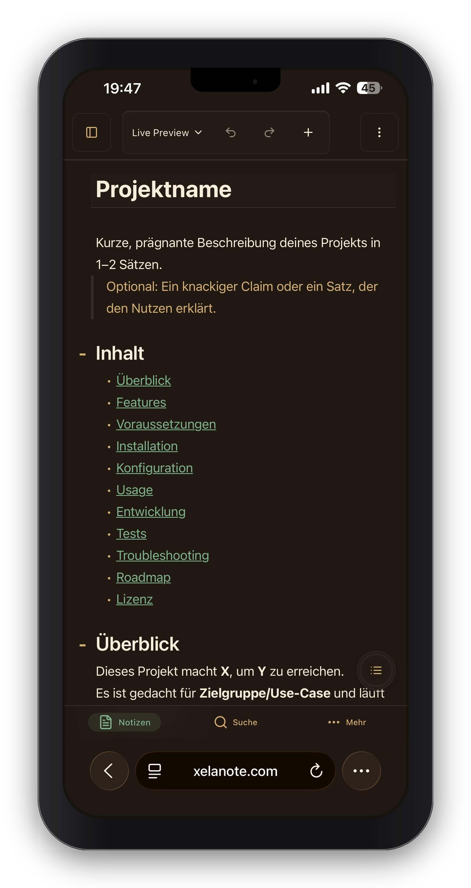&nbsp;&nbsp;
  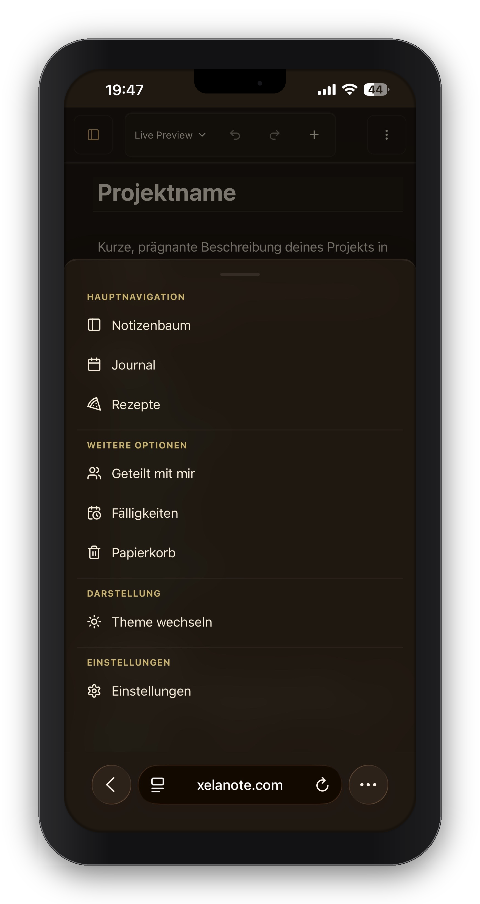&nbsp;&nbsp;
  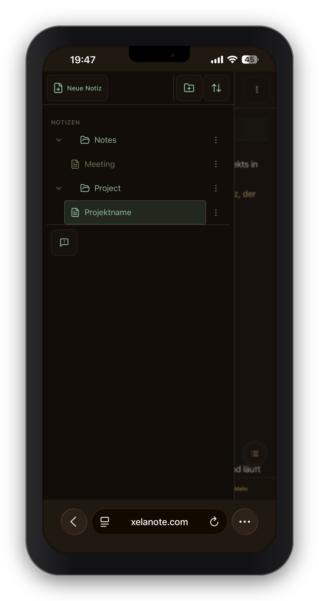&nbsp;&nbsp;
  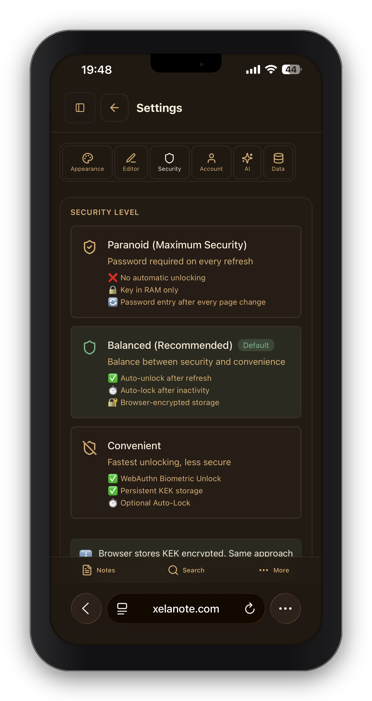
</p>
<p align="center">
  <sub>Installable PWA with live preview editor, bottom navigation, folder tree, and security settings</sub>
</p>

---

## Quick Start

### Docker (recommended)

```bash
# 1. Create environment file
cat > .env.local << 'EOF'
JWT_SECRET=$(openssl rand -hex 32)
XELANOTE_API_KEY_SECRET=$(openssl rand -hex 32)
XELANOTE_ENV=production
CORS_ALLOWED_ORIGINS=https://notes.example.com
EOF

# 2. Start the container
docker compose --env-file .env.local up -d --build
```

Open `http://localhost:8080` and create your first account.

### Local Development

**Prerequisites:** Go 1.25+, Node.js 22+, GCC (for SQLite CGO)

```bash
git clone https://github.com/xela-io/xelanote.git
cd xelanote
make init

export JWT_SECRET="$(openssl rand -hex 32)"
export XELANOTE_API_KEY_SECRET="$(openssl rand -hex 32)"

# Terminal 1 — backend with hot-reload on :8080
make dev

# Terminal 2 — frontend dev server on :5173
make run-frontend
```

Open `http://localhost:5173`.

---

## Configuration

### Required

| Variable | Description |
|----------|-------------|
| `JWT_SECRET` | Min. 64 characters. Generate with `openssl rand -hex 32` |
| `XELANOTE_API_KEY_SECRET` | Min. 64 characters. Required for API-key encryption at rest; must be different from `JWT_SECRET` |
| `CORS_ALLOWED_ORIGINS` | Comma-separated allowed origins (e.g. `https://notes.example.com`) |

### Optional

| Variable | Default | Description |
|----------|---------|-------------|
| `XELANOTE_DB` | `./data/xelanote.db` | SQLite database path |
| `XELANOTE_ENV` | `development` | Set to `production` for secure cookies and hardened defaults |
| `XELANOTE_JOURNAL_MODE` | `wal` | SQLite journal mode (`wal` or `delete`) |
| `XELANOTE_DB_KEY` | — | SQLCipher encryption key for database-at-rest encryption |
| `XELANOTE_DB_KEY_FILE` | — | Path to file containing the SQLCipher key |
| `TURNSTILE_SECRET_KEY` | — | Cloudflare Turnstile CAPTCHA secret |
| `TURNSTILE_SITE_KEY` | — | Cloudflare Turnstile CAPTCHA site key |
| `CLAUDE_API_KEY` | — | Anthropic Claude API key for AI features |
| `GEMINI_API_KEY` | — | Google Gemini API key for AI features |
| `OPENAI_API_KEY` | — | OpenAI ChatGPT API key for AI features |

---

## Tech Stack

| Layer | Technology |
|-------|------------|
| Backend | Go 1.25, Chi router, SQLite (FTS5, WAL mode) |
| Frontend | SvelteKit (Svelte 5 Runes), TypeScript, Tailwind CSS v4, CodeMirror 6 |
| Desktop | Tauri v2 (Rust + WebKit2GTK) |
| Crypto | XChaCha20-Poly1305, Argon2id, WebAuthn/FIDO2 |
| AI | Claude, Gemini, ChatGPT (multi-provider, BYOK) |
| CI/CD | GitHub Actions + Forgejo Actions (staging/production auto-deploy with rollback) |
| Infra | Docker (Alpine), Cloudflare Turnstile |

## Architecture

```
┌─────────────────────────────────────────────────────┐
│                    SvelteKit Frontend               │
│  ┌──────────┐ ┌──────────┐ ┌────────┐ ┌──────────┐ │
│  │CodeMirror│ │  Stores  │ │Offline │ │  Crypto  │ │
│  │ 6 Editor │ │(Svelte 5)│ │  Sync  │ │(XChaCha) │ │
│  └──────────┘ └──────────┘ └────────┘ └──────────┘ │
└──────────────────────┬──────────────────────────────┘
                       │ HTTP / WebSocket
┌──────────────────────▼──────────────────────────────┐
│                     Go Backend                      │
│  ┌──────────┐ ┌──────────┐ ┌────────┐ ┌──────────┐ │
│  │ API Layer│→│ Service  │→│   DB   │ │   LLM    │ │
│  │(Chi, JWT)│ │ (Logic)  │ │(SQLite)│ │(Multi-AI)│ │
│  └──────────┘ └──────────┘ └────────┘ └──────────┘ │
└─────────────────────────────────────────────────────┘
                       │
              ┌────────▼────────┐
              │  xelanote.db    │
              │  (single file)  │
              └─────────────────┘
```

- **Strict 3-layer backend**: API → Service → DB (enforced by CI guardrails — no layer skipping allowed)
- **52+ database migrations** with forward-only, incremental schema evolution
- **Svelte 5 only** — Svelte 4 store imports are blocked by pre-commit hooks and CI

---

## Development

| Command | Description |
|---------|-------------|
| `make init` | Install all dependencies and git hooks |
| `make dev` | Backend with hot-reload (Air) on `:8080` |
| `make run-frontend` | Vite dev server on `:5173` |
| `make build` | Production build (Go binary + static frontend) |
| `make test` | Backend tests |
| `make test-frontend` | Frontend unit tests (Vitest) |
| `make test-e2e` | End-to-end tests (Playwright) |
| `make test-coverage` | Coverage reports for backend + frontend |
| `make quality` | Lint, format, and typecheck (gofmt, ESLint, Prettier, svelte-check) |
| `make check-policy` | Architecture and security guardrail checks |
| `make docker` | Build Docker image |
| `make demo-db` | Generate demo database with sample data |

---

## Contributing

Contributions are welcome! Please see [`CONTRIBUTING.md`](CONTRIBUTING.md) for workflow, code style, and testing guidelines.

---

## License

MIT — see [`LICENSE`](LICENSE) for details.
