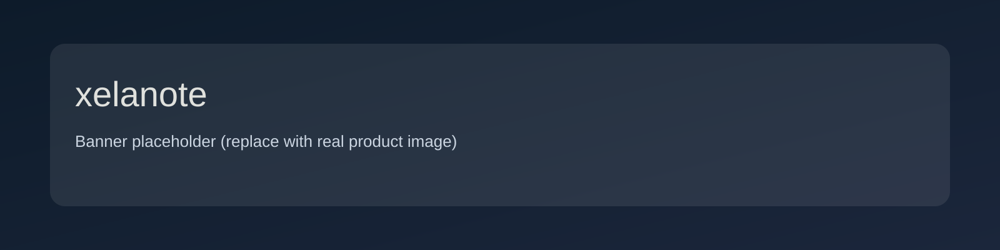
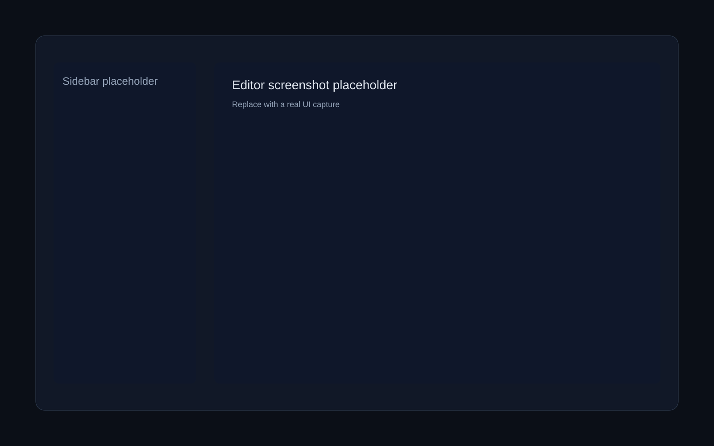
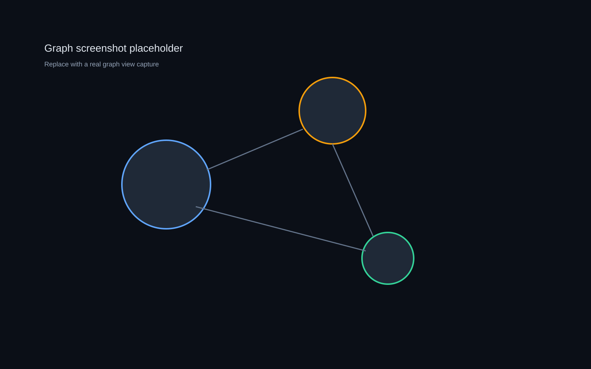

<p align="center">
  <!-- TODO: Replace with a real banner image -->
  
</p>

<p align="center">
  <!-- TODO: Replace with a high-res logo if available -->
  
</p>

<h1 align="center">xelanote</h1>

<p align="center">
  <strong>Self-hosted, encrypted note-taking with Wikilinks, Backlinks, and Full-Text Search.</strong>
  <br />
  <em>Your knowledge, your server, your rules.</em>
</p>

<p align="center">
  <a href="https://github.com/xela-io/xelanote/actions/workflows/ci.yml"></a>
  <a href="https://github.com/xela-io/xelanote/actions/workflows/quality.yml"></a>
  <a href="https://github.com/xela-io/xelanote/releases"></a>
  <a href="LICENSE"></a>
  
</p>

<p align="center">
  <a href="#features">Features</a>&nbsp;&nbsp;&bull;&nbsp;&nbsp;
  <a href="#installation">Installation</a>&nbsp;&nbsp;&bull;&nbsp;&nbsp;
  <a href="#usage">Usage</a>&nbsp;&nbsp;&bull;&nbsp;&nbsp;
  <a href="#configuration">Configuration</a>&nbsp;&nbsp;&bull;&nbsp;&nbsp;
  <a href="#contributing">Contributing</a>&nbsp;&nbsp;&bull;&nbsp;&nbsp;
  <a href="#license">License</a>
</p>

---

## Project Description

xelanote is a privacy-first, self-hosted note app that brings modern knowledge management features
(Wikilinks, backlinks, graph view, offline mode) together with optional end-to-end encryption. It
runs as a single Go binary with an embedded SvelteKit frontend and stores everything in a single
SQLite database file.

---

## Features

**Editor & Knowledge Management**

- Markdown editor with live preview (Obsidian-style WYSIWYG with syntax visible on active line)
- Wikilinks and backlinks with automatic reference tracking
- Interactive graph visualization of notes and connections
- Full-text search (server-side FTS5 + client-side search for encrypted notes)
- Folder hierarchy, tags, drag-and-drop reordering, and version history (up to 100 versions)
- Inline title editing (Bear/Apple Notes style), table of contents, collapsible task groups
- Find-in-note (Ctrl+F) and search-and-replace (Ctrl+H) with VS Code-style UI
- Due date syntax (`@due(YYYY-MM-DD)`) with colored badges and dedicated due dates page
- Command Palette (Ctrl+K) with extensible command registry

**Recipes**

- Structured recipe management with ingredients, portions, difficulty, and prep time
- AI-powered recipe import from URLs and images (with automatic F-to-C temperature conversion)
- Portion scaling, cookbook collections, recipe sharing, and dietary preference support
- Multi-provider AI integration (Claude, Gemini, ChatGPT) with per-provider model selection

**Infinite Canvas**

- Free-form spatial board (JSON Canvas spec v1.0) with text cards, embedded notes, links, and groups
- Drag-and-drop from sidebar, keyboard shortcuts, copy/paste, and 6 Gruvbox color presets

**Security & Encryption**

- Optional end-to-end encryption (AES-256-GCM, Argon2id KDF, zero-knowledge architecture)
- Per-note encryption toggle, folder encryption defaults, and encrypted search via client-side index
- Two-factor authentication (TOTP + WebAuthn/FIDO2 hardware keys + backup codes)
- Account lockout with rate limiting, CSRF protection, CSP headers, and security event logging

**Collaboration & Sharing**

- Note sharing (Viewer/Editor roles) with user search and permission management
- Folder sharing with implicit permission inheritance for all contained notes
- Cookbook/collection sharing with 3-tier priority permission chain

**Mobile & PWA**

- Progressive Web App with offline read/write mode (IndexedDB queue, conflict resolution)
- Responsive UI with bottom navigation bar, touch-optimized controls (WCAG AA 44px targets)
- iOS/Android install coach, dark mode splash screens, and portrait orientation lock
- Delta-sync with field projection for efficient mobile data transfer

**Customization & i18n**

- 23 themes (Gruvbox, One Dark/Light, Monokai, Ayu, Rose Pine, Kanagawa, Everforest, and more)
- Full internationalization (German + English, ~604 i18n keys per locale)
- AI text transformations (format, summarize, expand, translate, formal/informal)

**Infrastructure**

- Single Go binary with embedded SvelteKit frontend, SQLite database
- Docker-first deployment with auto-rollback, health checks, and CI/CD via Forgejo Actions
- Strict backend layering (API -> Service -> DB) enforced by CI guardrails

---

## Tech Stack

| Layer | Technology |
|-------|------------|
| Backend | Go 1.25, Chi v5.2.5, SQLite (FTS5, WAL mode) |
| Frontend | SvelteKit (Svelte 5 Runes), TypeScript, Tailwind CSS v4, CodeMirror 6 |
| Desktop | Electron (Linux AppImage/.deb) |
| Auth | JWT (access + refresh rotation), HttpOnly cookies, Argon2id, WebAuthn |
| AI | Claude, Gemini, ChatGPT APIs (text transformation, recipe import, suggestions) |
| CI/CD | GitHub Actions (CI, quality, security), Forgejo Actions (staging/production deploy) |
| Infra | Docker (Alpine), Cloudflare Turnstile CAPTCHA |

## Architecture

- `backend/`: Go API server (`cmd/server`) with strict layered modules:
  - `internal/api` — HTTP routing, handlers, middleware (CORS, CSRF, rate limiting, auth)
  - `internal/service` — Business logic, encryption, sharing, AI integration
  - `internal/db` — SQLite persistence, migrations (52+), FTS5 search
  - `internal/llm` — Multi-provider LLM client (Claude, Gemini, ChatGPT)
- `frontend/`: SvelteKit web app (Svelte 5 Runes only, no Svelte 4 stores):
  - `src/lib/stores/` — Reactive state (notes, tree, encryption, recipes, sharing, journal)
  - `src/lib/editor/` — CodeMirror 6 plugins (live preview, markdown, task sortable, scroll sync)
  - `src/lib/components/` — UI components (editor, dialogs, sidebar, canvas, recipes)
  - `src/lib/offline/` — IndexedDB queue, sync manager, conflict resolution
  - `src/lib/crypto/` — Client-side encryption (AES-256-GCM, Argon2id via @noble/hashes)
- `frontend/src-electron/`: Electron desktop wrapper (Linux)
- `docs/`: Comprehensive documentation (architecture, API, security, deployment, planning)

---

## Installation

**Prerequisites**

- Go 1.25+
- Node.js 22+
- GCC (for SQLite CGO)

**Local Development**

```bash
# Clone
git clone https://github.com/xela-io/xelanote.git
cd xelanote

# Install dependencies
make init

# Set required secret (min. 64 characters)
export JWT_SECRET="$(openssl rand -hex 32)"
```

---

## Usage

**Run locally**

```bash
# Terminal 1: Start backend with hot-reload (port 8080)
make dev

# Terminal 2: Start frontend dev server (port 5173)
make run-frontend
```

Open `http://localhost:5173` and create your first account.

**Docker (recommended)**

```bash
cat > .env.local << 'ENVEOF'
JWT_SECRET=your-secret-here-min-64-chars-use-openssl-rand-hex-32
XELANOTE_ENV=production
CORS_ALLOWED_ORIGINS=https://notes.example.com
ENVEOF

docker compose --env-file .env.local up -d --build
```

Open `http://localhost:8080` and create your first account.

**API example**

```bash
curl -X POST http://localhost:8080/api/auth/login \
  -H 'Content-Type: application/json' \
  -d '{"email":"you@example.com","password":"your-password"}'
```

Full API documentation: `docs/api.md`.

---

## Configuration

**Required**

| Variable               | Description                                                               |
| ---------------------- | ------------------------------------------------------------------------- |
| `JWT_SECRET`           | Min. 64 characters. Generate: `openssl rand -hex 32`                      |
| `CORS_ALLOWED_ORIGINS` | Comma-separated origins for production (e.g. `https://notes.example.com`) |

**Optional**

| Variable               | Default              | Description                                                  |
| ---------------------- | -------------------- | ------------------------------------------------------------ |
| `XELANOTE_DB`            | `./data/xelanote.db` | Path to SQLite database                                      |
| `XELANOTE_ENV`           | `development`        | Set to `production` for secure cookies and hardened defaults |
| `XELANOTE_JOURNAL_MODE`  | `wal`                | SQLite journal mode (`wal` or `delete`)                      |
| `XELANOTE_DB_KEY`        | —                    | SQLCipher encryption key for database-at-rest encryption     |
| `XELANOTE_DB_KEY_FILE`   | —                    | Path to file containing the SQLCipher key                    |
| `TURNSTILE_SECRET_KEY`   | —                    | Cloudflare Turnstile CAPTCHA secret                          |
| `TURNSTILE_SITE_KEY`     | —                    | Cloudflare Turnstile CAPTCHA site key                        |
| `CLAUDE_API_KEY`         | —                    | Anthropic Claude API key for AI features                     |
| `GEMINI_API_KEY`         | —                    | Google Gemini API key for AI features                        |
| `OPENAI_API_KEY`         | —                    | OpenAI ChatGPT API key for AI features                       |
| `PPROF_ENABLED`          | `false`              | Enable Go pprof profiling endpoint                           |

---

## Development Scripts

- `make init`: install frontend/backend dependencies and hooks
- `make dev`: run Go backend with hot-reload on `:8080` (via Air)
- `make run-frontend`: run Vite dev server on `:5173`
- `make build`: production build (backend binary + frontend static)
- `make test`: backend tests
- `make test-frontend`: frontend unit tests (Vitest)
- `make test-e2e`: Playwright end-to-end tests
- `make test-coverage`: backend + frontend coverage reports
- `make quality`: format/lint/typecheck checks (gofmt, eslint, prettier, svelte-check)
- `make check-policy`: architecture/security guardrails (layering, Svelte 5-only imports, auth-storage checks)
- `make docker`: build Docker image
- `make demo-db`: generate demo database with sample data

Full list: `docs/environment-variables.md`.

## Quality Guardrails

- Backend follows strict layering: `api -> service -> db` (enforced by `scripts/check-layer-violations.sh`).
- Frontend disallows Svelte 4 store imports in app code (`scripts/check-svelte4-imports.sh`).
- Auth token persistence in `localStorage` is blocked by policy checks (`scripts/check-security-patterns.sh`).
- CI runs `ci.yml`, `quality.yml`, and `security.yml` on pushes/PRs.

---

## Screenshots

<!-- TODO: Replace with real screenshots -->

<p align="center">
  
</p>

<p align="center">
  
</p>

---

## Contributing

Contributions are welcome. Please see `CONTRIBUTING.md` for workflow, style, and test guidelines.

---

## License

This project is licensed under the MIT License. See `LICENSE` for details.
